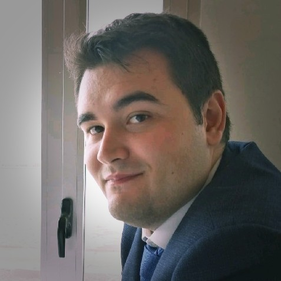

------------------------------------------------------------------------

1.  <alejandrogomeznoe@gmail.com>

2.  [algono](https://github.com/algono)

3.  [algono](https://gitlab.com/algono)

{width="4cm" height="4cm"}

------------------------------------------------------------------------

Conocimientos
=============

Lenguajes
---------

### Programación

C\#, Java, Typescript, Javascript, Dart, Python, SQL

Scripting
---------

Shell

### Markup

HTML 5, CSS 3, XML, RSS , Markdown , LaTeX

Frameworks
----------

NodeJS , Android (Java) , Flutter , Unity , Drupal

Otros
-----

Trello , Amazon Alexa

Estudios
========

Secundaria y Bachillerato
-------------------------

Campus Científicos - 2015
-------------------------

Durante el verano de 2015, participé en los [Campus
Científicos](https://www.campuscientificos.es/) (organizados por la
FECYT y el ministerio de Educación), cursando el proyecto de \"Seguridad
en Redes e Internet\" en la universidad Carlos III de Madrid.

Universidad
-----------

Actualmente (2020), estudio el Grado de Ingeniería Informática en la
*Universitat Politècnica de València (UPV)*.

He completado todas las asignaturas, y sólo me queda el Trabajo de Fin
de Grado (TFG).

Idiomas
=======

-   Español, nativo

-   Valenciano, nivel B1

-   Inglés, nivel B2 (*First Certificate in English - Cambridge*)

Actividades
===========

Mentor - Technovation Challenge
-------------------------------

Participé como mentor voluntario en el concurso de Iridescent
*Technovation Challenge* en su edición del año 2019, en colaboración con
el [American Space](https://cdl.upv.es/american-space), una asociación
de la *Universitat Politècnica de València (UPV)*.

Otros
=====

-   Carnet de conducir (tipo B).
